# p03-movimiento-fisica-unity
- Pablo Santana González alu0101480541@ull.edu.es
-----------------------------------------------
# Física
## Situación 1

Como podemos ver, el cubo no atraviesa el plano. Esto se debe a que el plano es un static collider que, al entrar en contacto con el Rigidbody collider, detecta la colisión y evita que continue.


## Situación 2

La esfera cae ya que ahora tiene rigidbody y es considerada para la simulación de físicas.


## Situación 3

La esfera, al ser kinematic, no es afectada por la simulación de físicas.

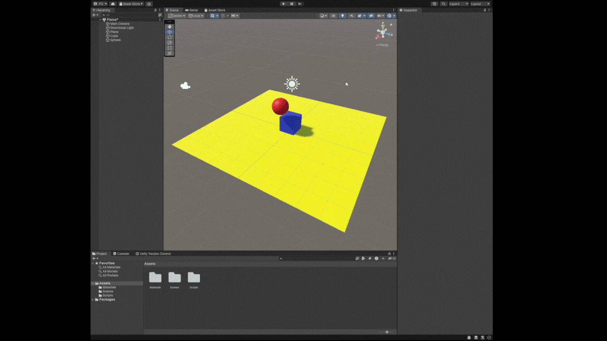

## Situación 4

Al asignarle un Rigidbody al plano para que sea físico, podemos ver como el plano, la esfera y el cubo caen al vacío. Esto pasa en el resto de ejercicios de ahora en adelante si pusieramos el plano como un objeto con rigidbody normal.


Para solventar esto, de ahora en adelante usaremos un plano con rigidbody, pero sera kinetic.

## Situación 5

Podemos ver que el cubo se mueve un poco cuando colisiona la esfera.

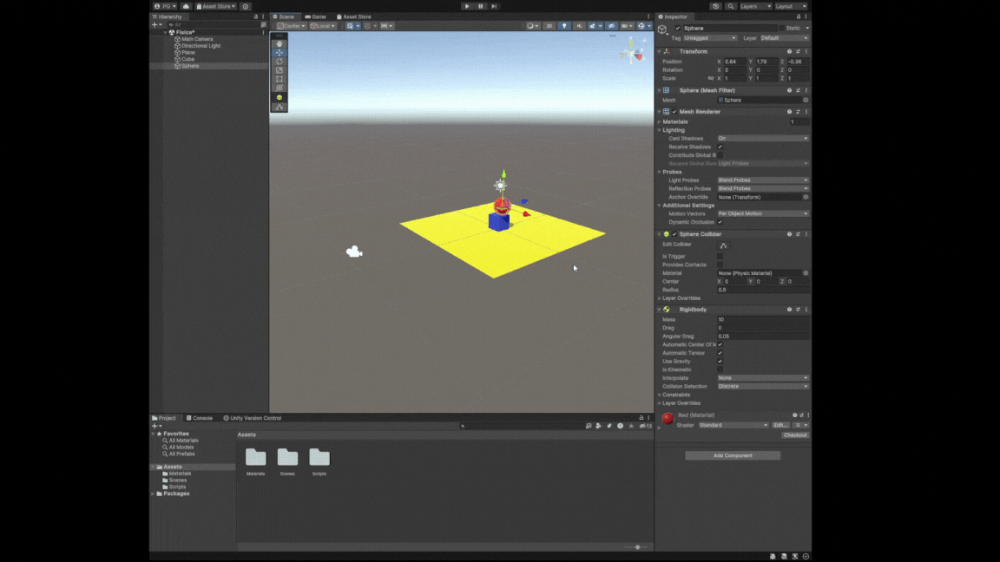

## Situación 6

Podemos ver que el cubo se mueve mucho más que en la situación anterior.

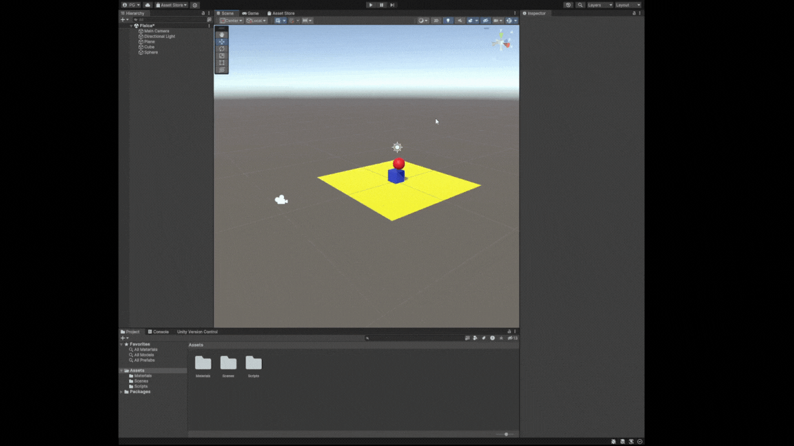

## Situación 7

A causa del material con fricción, la esfera se desplaza más lentamente, aunque es poco visible. En el ejercicio 12 del apartado de movimiento veremos un ejemplo en el que esta diferencia es más notable.

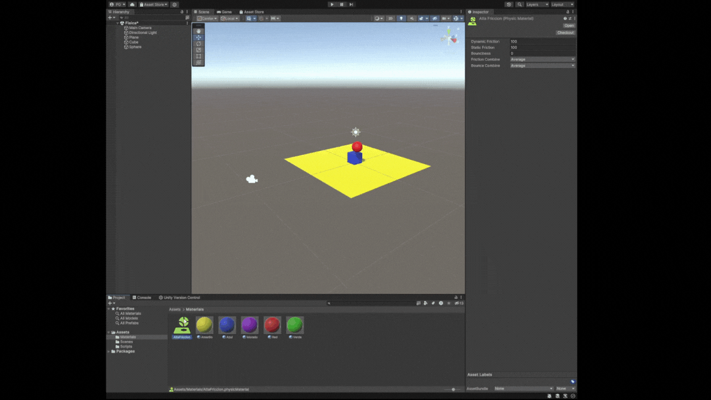

## Situación 8

Como la esfera es un trigger y no es físico, no le afecta la gravedad y se queda levitando.


## Situación 9

Al ser física, la esfera es afectada por la gravedad. Pero al ser un trigger, no se tiene en cuenta para la simulación de físicas (al menos en las colisiones) y por eso el plano no la para de caer al vacío.

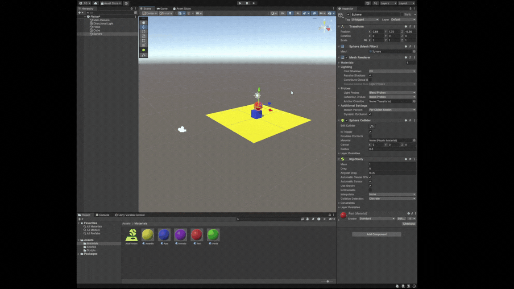

# Movimiento
## Ejercicio 1
Como se puede ver, al pulsar una tecla se indica por pantalla el nombre de dicha tecla así como el valor de multiplicar el valor del eje sobre el que se está interactuando por la velocidad indicada.


```c#
    void Update()
    {
        float movimiento_horizontal = Input.GetAxis("Horizontal");
        if (movimiento_horizontal > 0) {
            Debug.Log("Presionada flecha derecha. Eje Horizontal: " + movimiento_horizontal * velocidad);
        } else if (movimiento_horizontal < 0) {
            Debug.Log("Presionada flecha izquierda. Eje Horizontal: " + movimiento_horizontal * velocidad);
        }

        float movimiento_vertical = Input.GetAxis("Vertical");
        if (movimiento_vertical > 0) {
            Debug.Log("Presionada flecha arriba. Eje Vertical: " + movimiento_vertical * velocidad);
        } else if (movimiento_vertical < 0) {
            Debug.Log("Presionada flecha abajo. Eje Vertical: " + movimiento_vertical * velocidad);
        }
    }
```

## Ejercicio 2

Para este ejercicio, vamos al apartado de `Project Settings` y luego al de `Input Manager`. Buscamos el eje de disparar (he usado `Fire 1`) y le asignamos al botón positivo la h. 

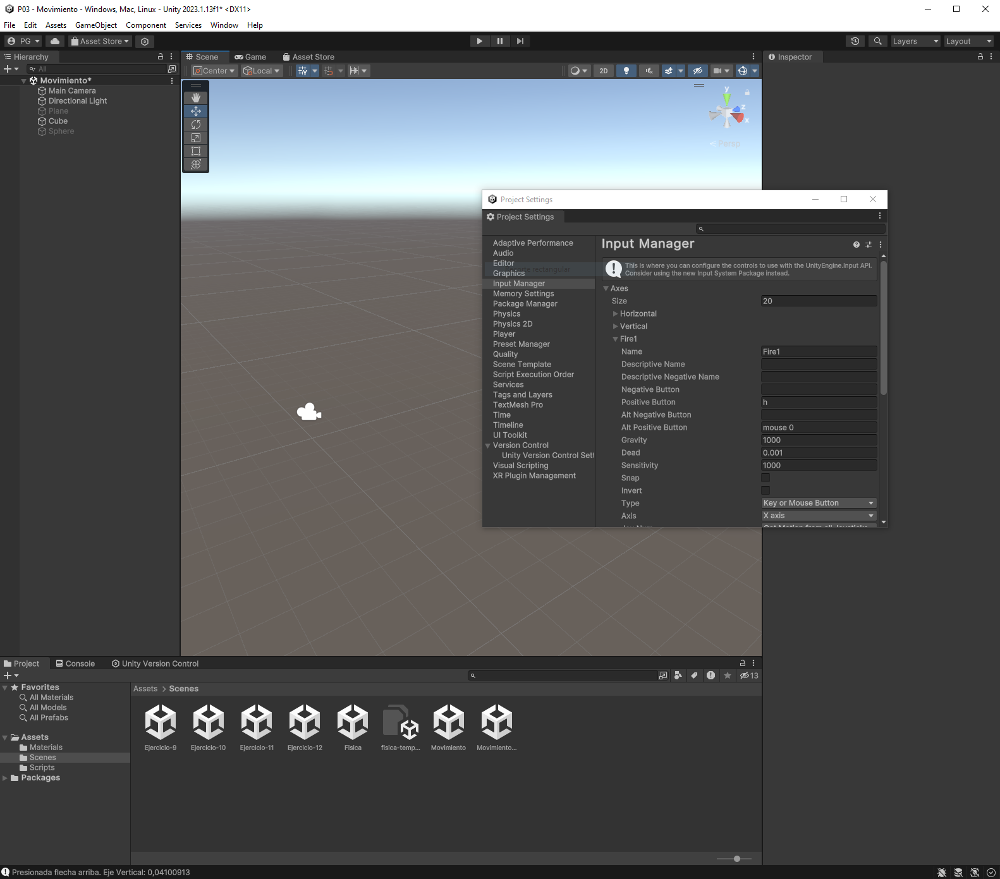

## Ejercicio 3


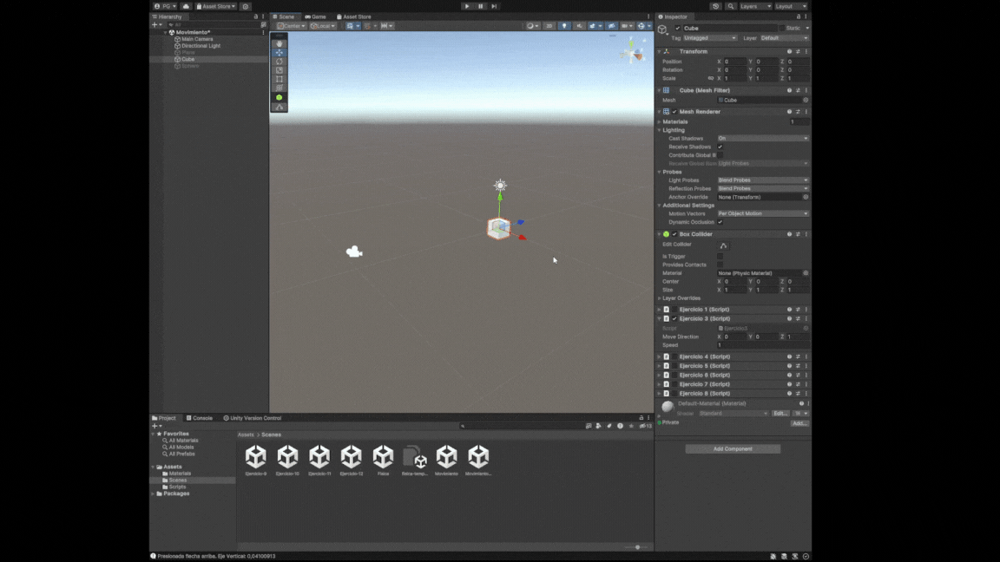

## Ejercicio 4


## Ejercicio 5

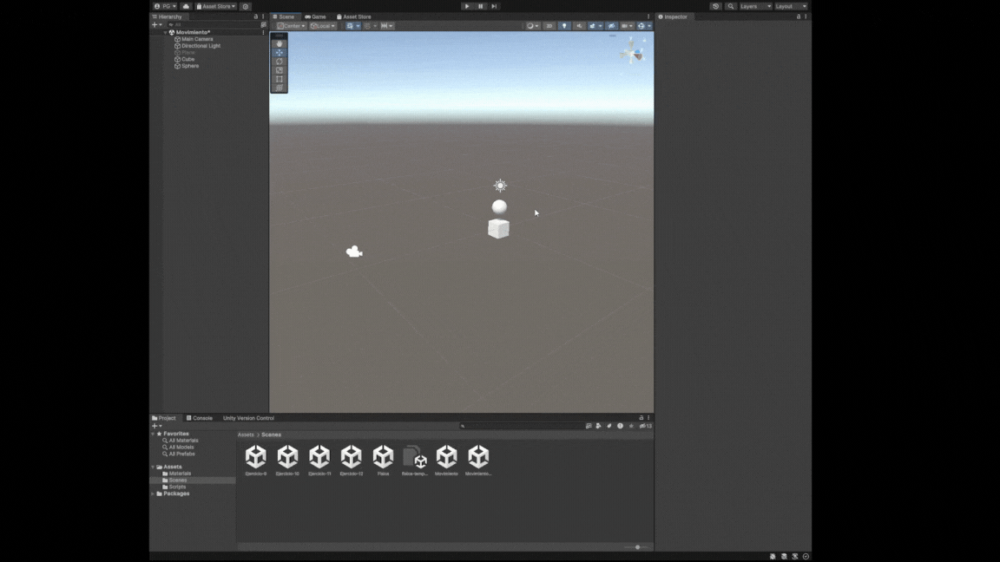

## Ejercicio 6

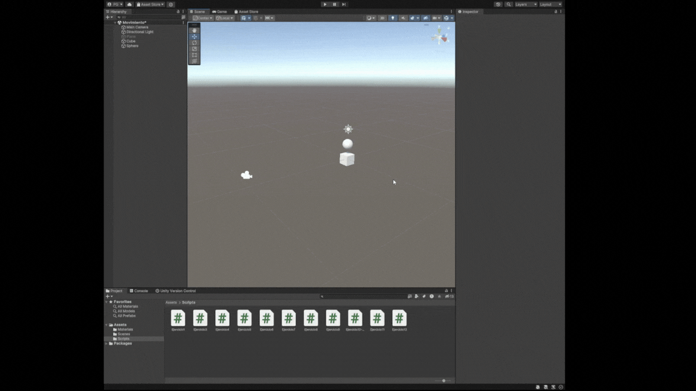

## Ejercicio 7

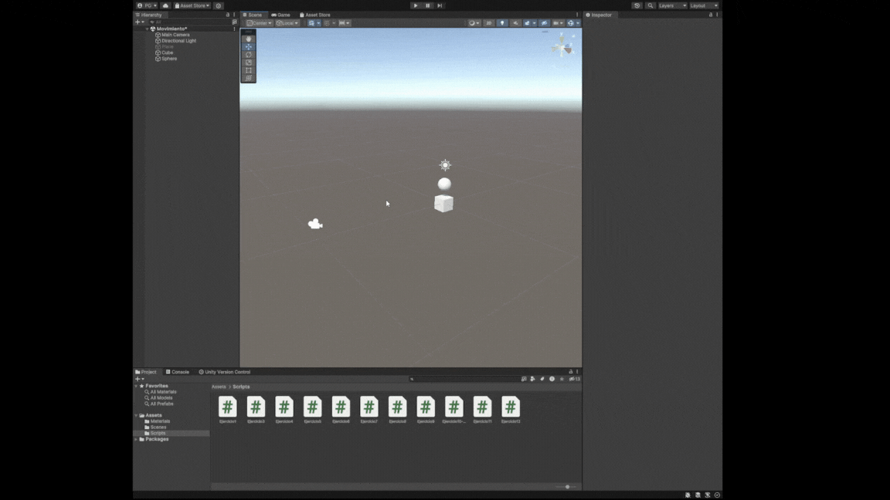

## Ejercicio 8

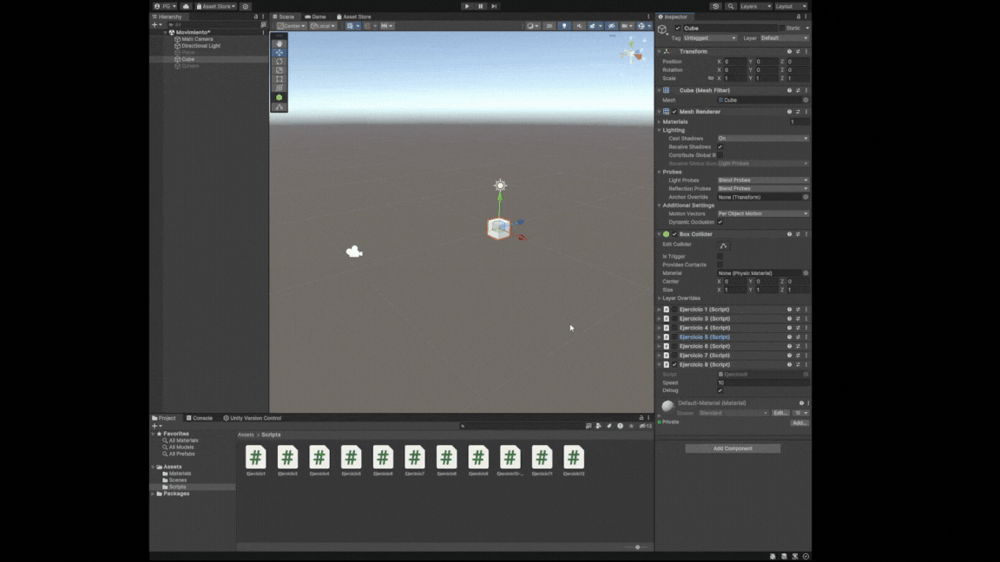

## Ejercicio 9

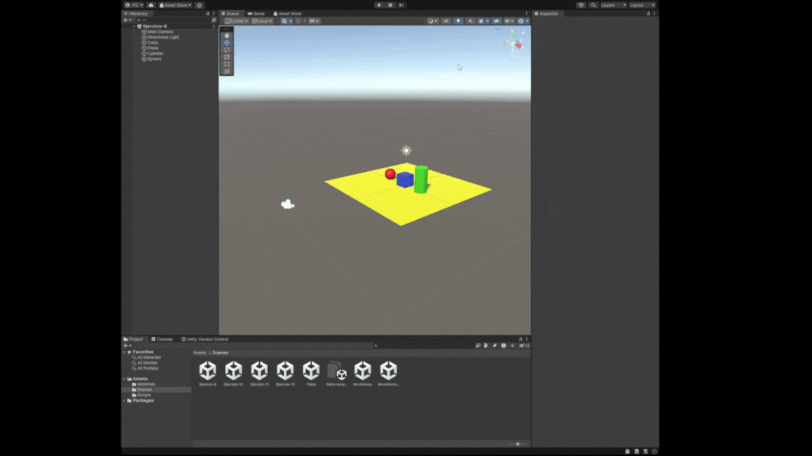

## Ejercicio 10

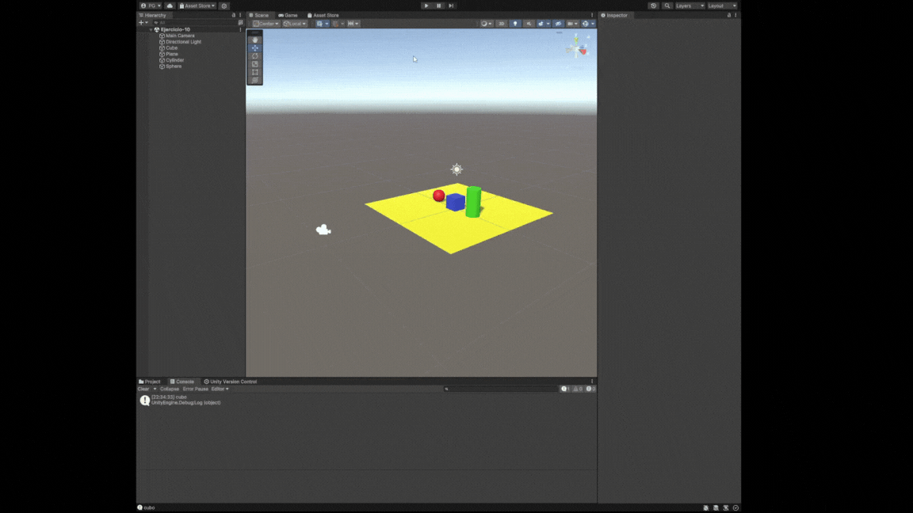

## Ejercicio 11


## Ejercicio 12


