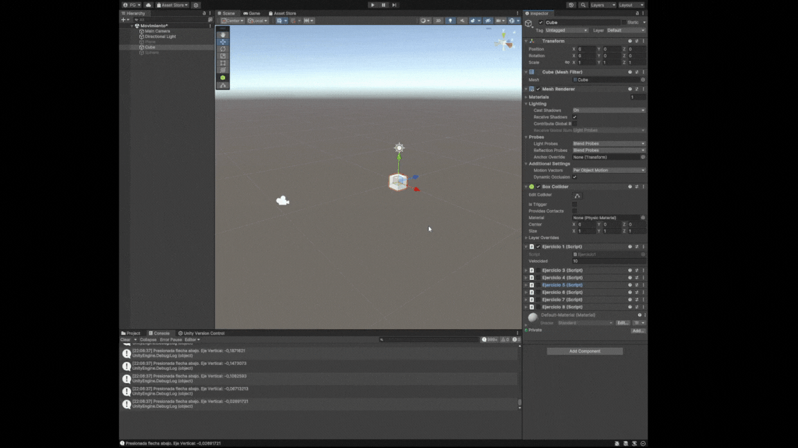
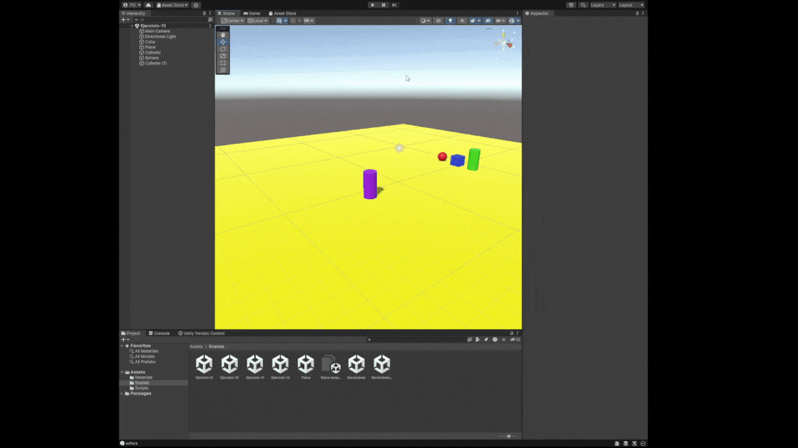

# p03-movimiento-fisica-unity
- Pablo Santana González alu0101480541@ull.edu.es
-----------------------------------------------
# Física
## Situación 1

Como podemos ver, el cubo no atraviesa el plano. Esto se debe a que el plano es un static collider que, al entrar en contacto con el Rigidbody collider, detecta la colisión y evita que continue.


## Situación 2

La esfera cae ya que ahora tiene rigidbody y es considerada para la simulación de físicas.


## Situación 3

La esfera, al ser kinematic, no es afectada por la simulación de físicas.


## Situación 4

Al asignarle un Rigidbody al plano para que sea físico, podemos ver como el plano, la esfera y el cubo caen al vacío. Esto pasa en el resto de ejercicios de ahora en adelante si pusieramos el plano como un objeto con rigidbody normal.


Para solventar esto, de ahora en adelante usaremos un plano con rigidbody, pero sera kinetic.

## Situación 5

Podemos ver que el cubo se mueve un poco cuando colisiona la esfera.


## Situación 6

Podemos ver que el cubo se mueve mucho más que en la situación anterior.


## Situación 7

A causa del material con fricción, la esfera se desplaza más lentamente, aunque es poco visible. En el ejercicio 12 del apartado de movimiento veremos un ejemplo en el que esta diferencia es más notable.


## Situación 8

Como la esfera es un trigger y no es físico, no le afecta la gravedad y se queda levitando.


## Situación 9

Al ser física, la esfera es afectada por la gravedad. Pero al ser un trigger, no se tiene en cuenta para la simulación de físicas (al menos en las colisiones) y por eso el plano no la para de caer al vacío.


# Movimiento
## Ejercicio 1
Como se puede ver, al pulsar una tecla se indica por pantalla el nombre de dicha tecla así como el valor de multiplicar el valor del eje sobre el que se está interactuando por la velocidad indicada.



```c#
    void Update()
    {
        float movimiento_horizontal = Input.GetAxis("Horizontal");
        if (movimiento_horizontal > 0) {
            Debug.Log("Presionada flecha derecha. Eje Horizontal: " + movimiento_horizontal * velocidad);
        } else if (movimiento_horizontal < 0) {
            Debug.Log("Presionada flecha izquierda. Eje Horizontal: " + movimiento_horizontal * velocidad);
        }

        float movimiento_vertical = Input.GetAxis("Vertical");
        if (movimiento_vertical > 0) {
            Debug.Log("Presionada flecha arriba. Eje Vertical: " + movimiento_vertical * velocidad);
        } else if (movimiento_vertical < 0) {
            Debug.Log("Presionada flecha abajo. Eje Vertical: " + movimiento_vertical * velocidad);
        }
    }
```

## Ejercicio 2

Para este ejercicio, vamos al apartado de `Project Settings` y luego al de `Input Manager`. Buscamos el eje de disparar (he usado `Fire 1`) y le asignamos al botón positivo la h. 


## Ejercicio 3

Estos son los casos comprobados

1. duplicas las coordenadas de la dirección del movimiento. El movimiento es mayor, se desplaza una distancia más larga.
2. duplicas la velocidad manteniendo la dirección del movimiento. Se desplaza una distancia más larga.
3. la velocidad que usas es menor que 1. El desplazamiento es mucho más corto.
4. la posición del cubo tiene y>0. No pasa nada en concreto, el cubo se sigue desplazando en la dirección indicada desde un punto más alto. Esto se debe a que Translate usa el sistema de referencia local por defecto.
5. intercambiar movimiento relativo al sistema de referencia local y el mundial. No pasa nada, ya que Translate mueve la distancia que se haya puesto en la dirección del vector y en este caso no hemos rotado el sistema de referencia local, por lo que es el mismo que el mundial (en cuanto a rotación).

```c#
public class Ejercicio3 : MonoBehaviour
{
    public Vector3 moveDirection = new Vector3(1, 0, 0);
    public float speed = 2f;
    // Start is called before the first frame update
    void Start()
    {    
    }
    // Update is called once per frame
    void Update()
    {
        if (Input.GetKeyDown(KeyCode.Space)) {
            transform.Translate(moveDirection * speed);
        }
    }
}
```


## Ejercicio 4

El siguiente script fue añadido como componente a cada uno de los objetos a mover. Se crearon ejes virtuales nuevos para referirse al eje vertical y horizontal de la esfera (y se eliminaron los botones WASD del eje virtual y horizontal normal). De esta manera se pueden asignar los nombres de los ejes desde el inspector.

```c#
public class Ejercicio4 : MonoBehaviour
{
    public float speed = 1f;
    public string vertical = "";
    public string horizontal = "";
    // Start is called before the first frame update
    void Start()
    {
    }

    // Update is called once per frame
    void Update()
    {
        float horizontal_movement = Input.GetAxis(horizontal);
        float vertical_movement = Input.GetAxis(vertical);

        transform.Translate(horizontal_movement * speed, vertical_movement * speed, 0);
    }
}
```


## Ejercicio 5

En comparación con el ejercicio anterior, el movimiento es mucho más lento. Esto se debe a que está escalado por el tiempo de generación de frames.

```
public class Ejercicio5 : MonoBehaviour
{
    public float speed = 1f;
    public string vertical = "";
    public string horizontal = "";
    // Start is called before the first frame update
    void Start()
    {
    }

    // Update is called once per frame
    void Update()
    {
        float horizontal_movement = Input.GetAxis(horizontal);
        float vertical_movement = Input.GetAxis(vertical);

        transform.Translate(horizontal_movement * speed * Time.deltaTime, vertical_movement * speed * Time.deltaTime, 0);
    }
}
```


## Ejercicio 6

Para que el cubo persiga a la esfera, tenemos que averiguar el vector de dirección formado entre la posición en el transform de ambos. Al obtenerlo, lo normalizamos para que no se desplace de manera instantánea a la posición de la esfera y luego usamos Translate.

```c#
public class Ejercicio6 : MonoBehaviour
{
    public float speed = 1f;
    // Start is called before the first frame update
    void Start()
    {
    }

    // Update is called once per frame
    void Update()
    {
        GameObject sphere = GameObject.FindWithTag("esfera");
        Vector3 movement = sphere.transform.position - gameObject.transform.position;
        movement = movement.normalized;
        gameObject.transform.Translate(movement * speed * Time.deltaTime);
    }
}
```


## Ejercicio 7

Similar al ejercicio anterior. Para realizar la rotación se usa el método LookAt. Hay que tener en cuenta que al haber rotado el eje del objeto ahora hay que especificar que el eje que se va a usar para el desplazamiento es del mundo (Space.World). 

```c#
public class Ejercicio7 : MonoBehaviour
{
    public float speed = 1f;
    // Start is called before the first frame update
    void Start()
    {
        
    }

    // Update is called once per frame
    void Update()
    {
        GameObject sphere = GameObject.FindWithTag("esfera");
        Vector3 movement = sphere.transform.position - gameObject.transform.position;
        movement = movement.normalized;
        gameObject.transform.Translate(movement * speed * Time.deltaTime, Space.World);
        gameObject.transform.LookAt(sphere.transform);
    }
}
```


## Ejercicio 8

Para realizar la rotación, he usado Rotate. Un error que tuve (y ya está corregido) fue no tener en cuenta la rotación del eje que hace Rotate. Lo solucioné utilizando los sistemas de referencia apropiados. En el código, he escrito una alternativa usando sistema de referencia mundial y relativo al objeto.

```c#
public class Ejercicio8 : MonoBehaviour
{
    public float speed = 1f;
    public bool debug = false;
    // Start is called before the first frame update
    void Start()
    {
    }

    // Update is called once per frame
    void Update()
    {
        if (debug) {
            Debug.DrawRay(gameObject.transform.position, gameObject.transform.forward * 100);
        }
        bool forward = Input.GetKey("up");
        if (forward) {
           // Coordenadas del mundo
           // transform.Translate(gameObject.transform.forward * speed * Time.deltaTime, Space.World);
           // Relativo al sistema de referencia del objeto.
           transform.Translate(Vector3.forward * speed * Time.deltaTime);
        }
        float rotation = Input.GetAxis("Horizontal");
        // Coordenadas del mundo
        //transform.Rotate(0f, rotation * speed * 5 * Time.deltaTime, 0f, Space.World);
        // Relativo al sistema de referencia del objeto.
        transform.Rotate(0f, rotation * speed * 5 * Time.deltaTime, 0f);
    }
}
```


## Ejercicio 9

Para realizar los movimientos he reutilizado scripts anteriores. En el cilindro he incluido este script para mostrar por consola la etiqueta del objeto con el que colisiona. Me he dado cuenta que las colisiones a veces no se detectan (se puede ver en el GIF). Esto puede deberse a que tanto el cubo como la esfera no son rigidbody, y la reacción con static colliders es diferente.

```c#
public class Ejercicio9 : MonoBehaviour
{
    // Start is called before the first frame update
    void Start()
    {
        
    }

    // Update is called once per frame
    void Update()
    {
        
    }
    void OnCollisionEnter(Collision collision) 
    {
        if (collision.gameObject.tag != "plano") {
            Debug.Log(collision.gameObject.tag);
        }
    }
}
```


## Ejercicio 10

Los scripts se mantienen iguales. El que cambia es el de la esfera, que al ser un rigidbody se tiene que mover con físicas. El siguiente script define el nuevo comportamiento de la esfera. Con respecto al cubo, al ser kinematic podemos usar su transform para moverlo.

```c#
public class Ejercicio10Esfera : MonoBehaviour
{
    public float speed = 1f;
    public string vertical = "";
    public string horizontal = "";
    // Start is called before the first frame update
    void Start()
    {
        
    }

    // Update is called once per frame
    void Update()
    {
        
    }

    void FixedUpdate() 
    {
        float horizontal_movement = Input.GetAxis(horizontal) * speed;
        float vertical_movement = Input.GetAxis(vertical) * speed;
        Vector3 force = new Vector3(horizontal_movement, vertical_movement, 0f);
        GetComponent<Rigidbody>().AddForce(force);
    }
}
```


## Ejercicio 11

El cambio se hace sobre el script de detección de colisiones del cilindro. En este caso ya no será OnCollisionEnter, sino en OnTriggerEnter.

```c#
public class Ejercicio11 : MonoBehaviour
{
    // Start is called before the first frame update
    void Start()
    {
        
    }

    // Update is called once per frame
    void Update()
    {
        
    }

    private void OnTriggerEnter(Collider collider) 
    {
        if (collider.tag != "plano") {
            Debug.Log(collider.tag);
        }
    }
}
```


## Ejercicio 12

El siguiente script corresponde al cilindro. Al ser físico, lo actualizo en FixedUpdate con MovePosition y AddForce, en vez de usando Translate.

```c#
public class Ejercicio12 : MonoBehaviour
{
    public float speed = 1f; 
    // Start is called before the first frame update
    void Start()
    {
        
    }

    // Update is called once per frame
    void Update()
    {
        
    }

    void FixedUpdate() 
    {
        if (Input.GetKey("space")) {
            GameObject sphere = GameObject.FindWithTag("esfera");
            Vector3 direction = (sphere.transform.position - transform.position).normalized;
            // Sin cambios de altura.
            direction.y = 0;
            GetComponent<Rigidbody>().MovePosition(transform.position + direction);
            return;
        }
        float horizontal_movement = Input.GetAxis("Horizontal") * speed;
        float vertical_movement = Input.GetAxis("Vertical") * speed;
        Vector3 force = new Vector3(horizontal_movement, 0, vertical_movement);
        GetComponent<Rigidbody>().AddForce(force);
    }
}
```



He experimentado con otros casos:

### Esfera con 10 veces más masa que el cilindro

Podemos ver como al cilindro le cuesta más mover la esfera.

### Cilindro con 10 veces más masa que la esfera

Podemos ver como el cilindro se mueve más lento y mueve la esfera con facilidad.

### Esfera Kinematic

La esfera es cinemática y no le afectan las fuerzas del motor de físicas y por eso no le empuja el cilindro, pero si tiene colisión y por ello no le atraviesa el cilindro.

### Esfera Trigger

La esfera ahora no tiene colisiones y por eso el cilindro atraviesa la esfera.

### Cilindro Alta Fricción

El cilindro le cuesta más moverse debido al material con fricción que tiene.

### Cilindro Sin Fricción

El cilindro se mueve sin problemas.
